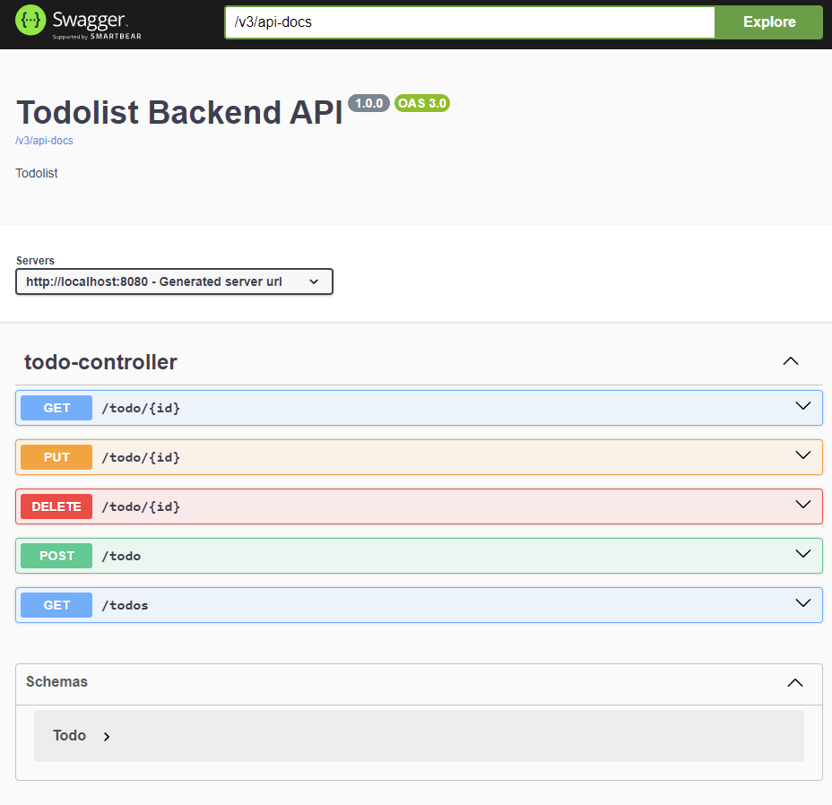

# ***Spring Boot & React***  
  

## ***Project***  
  

The project aims to build a todo list application using Spring Boot and React JS. The user-entered data will be saved to the database. We aim to create CRUD operations and build a Fullstack application.  
  

## ***Proje***  
  

Proje spring boot ve react js kullanarak todo list uygulaması yapmaktır. Kullanıcıdan alınan verileri databaseye kayıt yapacaktır. CRUD işlemler oluşturup bir Fullstack uygulama yapmış oluyoruz.  
  

---  

```sh
Git Clone 

git clone https://github.com/dogukancifcii/techcareer-fullstack-project.git
```


## Todo List Project:
Spring Boot And React JS

- Backend: Java Core, Spring Framework
- Frontend:  React JS, JS, +ES5
- 🎁 Todo List
--- 

## TECHNOLOGY && Features
- HTML5
- CSS3
- RESPONSIVE DESIGN
- BOOTSTRAP5
- JAVASCRIPT
- MYSQL
- JAVA CORE
- SPRING FRAMEWORK
- SPRING BOOT
---

## Libraries && Programming
- Lombok
- Mysql
- Open Api Configuration
- MYSQL
- JAVA CORE
- SPRING FRAMEWORK
- SPRING BOOT

---

## REACT INSTALL
```sh
npm install -g create-react-app
npx create-react-app techcareer-fullstack-frontend


npm install axios --save
npm install react-router-dom --save
npm install react-icons

or
npm install
cd techcareer-fullstack-frontend
npm start
```

## Npm Komutları 
```sh
node -v
npm  -v

# package.json oluşturmak dikkat proje ismi: 
# 1-) küçük harflerle
# 2-) boşluklar olmamalıdır bunun yerine (-) 
# 3-) üğşçö kullanma
npm init 
npm init -y

# package.json içindeki kütüphaneleri proje dahil etmek için kullanıyoruz.
npm install 
npm i

# local npm'e neler yüklemişim 
npm list   => LOCAL

# Global npm'e neler yüklemişim 
npm list -g  => GLOCAL

# Global npm'e neler yüklemişim 
# --depth=0 sadece ana yüklediğim dosyaları göster 
npm list -g --depth=0

# npm Localde nereye yüklenmiş
npm root 

# npm Globalde nereye yüklenmiş.
# C:\Users\90553\AppData\Roaming\npm\node_modules
npm root -g

# SEARCH
# npm üzerinde arama yapmak için kullanıyoruz.
npm search express 
npm search mocha 

# INSTALL 
# --save (Production ortamında kurulması gerekiyor)
npm install -g bower --save
npm install  express --save
npm install  express@4.18.1 --save # Semantic Version: 4.18.1 

# -dev (Test ortamında kurulması)
npm install mocha --save-dev
npm install tailwindcss -D

# DELETE
npm unistall express 

# UPDATE
npm update # Bütün bağımlılıkları güncellemek
npm update express 
```


---


## Installation
Dillinger requires [Node.js](https://nodejs.org/) v10+ to run.
REACT JS

```sh
npm -v
node -v
npx create-react-app techcareer-fullstack-frontend
npm i
cd blog
npm start
```
---

## VS CODE EXTENSIONS
```sh
- Browser preview
- Auto Close tag
- Auto import
- Auto rename tag
- Es7+ React/REdux/React-Native snippets
- Html Snippets
- Live Server
- Open-in-Browser
- Prettier Code formatter
- Project Manager
```
---

## Google Chrome Plugins
for project , plugins

| Google | CHROME |
| ------ | ------ |
| React Developer Tools | [React Developer Tools][RTool] |

---

## PORT
for project , Port

| NAME | PORT |
| ------ | ------ |
| React JS| [React][http://localhost:3000] |
| SPRING| [Spring][http://localhost:8080] |
| MySQL| [MySQL][http://localhost:3306] |
| SWAGGER| [API DOCUMENT][http://localhost:8080/swagger-ui.html] |

---
## POSTMAN URL
for project , Port

| NAME | PORT |
| ------ | ------ |
| Post todo| [http://localhost:8080/todo] |
| Get todos| [http://localhost:8080/todos] |
| Get todo for id| [http://localhost:8080/todo/${id}] |
| Edit todo| [http://localhost:8080/todo/${id}] |
| Delete todo| [http://localhost:8080/todo/${id}] |

---
## SWAGGER-UI
<div align="center">
  
</div>

###

## License

**Fullstack Todo List**

